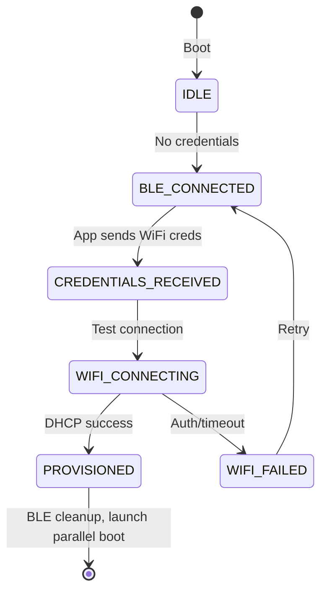

# Boot Architecture & Initialization Sequence

## Overview

This document describes the parallel boot architecture for the KannaCloud device firmware. The design prioritizes reliability, graceful degradation, and user experience by initializing sensors and network services in parallel tasks.

## Design Principles

1. **Parallel Initialization**: Sensors and network initialize simultaneously to minimize boot time
2. **Graceful Degradation**: Device operates with any combination of available hardware
3. **No Expected Sensors**: Flexible sensor platform - any EZO sensor combination is valid
4. **Retry Logic**: Comprehensive retry mechanisms for transient I2C issues
5. **User-Facing Priority**: Sensors get higher priority (for future touch display)
6. **Non-Blocking Network**: Network failures don't prevent sensor operation
7. **Proper TLS Ordering**: Certificates provisioned before MQTT/HTTPS services start


## Boot Coordinator Module

`boot/boot_coordinator.c` centralizes the parallel boot orchestration:

- Creates and owns the system event group so every boot task shares a consistent readiness contract.
- Prepares `sensor_pipeline_context_t` / `network_boot_config_t` wiring helpers that hide the event bits from feature modules.
- Launches the high-priority sensor task automatically when provisioning starts (via `boot_coordinator_launch_sensors_async`).
- Exposes `boot_coordinator_wait_bits()` so `app_main()` only waits on symbolic bits instead of manipulating the event group directly.

This module keeps `main/main.c` focused on sequencing rather than bookkeeping, which was a key goal for Segment 1 of the reorganization plan.

---

## Sensor Pipeline Module

`sensors/pipeline.c` encapsulates the wiring between the boot coordinator and the sensor task so that no other module manages raw `sensor_boot_config_t` structs or event bits directly.

- `sensor_pipeline_prepare()` normalizes the `EventGroupHandle_t`, ready bit, and desired `reading_interval_sec` into a `sensor_pipeline_launch_ctx_t` that is safe to reuse across sync/async launches.
- `sensor_pipeline_launch()` is a convenience wrapper that calls `sensor_boot_start()` and sets bookkeeping so repeated launches during provisioning are harmless.
- `sensor_pipeline_launch_async()` lets provisioning callbacks trigger sensors without blocking; the boot coordinator provides this as the callback it hands to the provisioning runner.
- `sensor_pipeline_snapshot()` / `sensor_pipeline_register_snapshot_listener()` expose a `sensor_pipeline_snapshot_t` structure that bundles sensor readiness bits, current reading interval, and the latest cached telemetry so MQTT + HTTPS code no longer fetches raw state out of `sensor_manager`.

The pipeline is the only place that touches the sensor task’s launch state, which keeps `boot_coordinator.c` declarative and makes future Segment 3 work (shared sensor config headers, telemetry structs) easier to layer on.

---

## Phase 0: WiFi Provisioning (First Boot Only)

### When Does Provisioning Occur?

WiFi provisioning over BLE is a **prerequisite phase** that runs **before** the parallel boot architecture. It only occurs when:
- First boot (no WiFi credentials in NVS)
- WiFi credentials cleared (short press reset button)
- Stored credentials invalid (network changed, wrong password)

If valid WiFi credentials exist in NVS, this phase is **completely skipped** and the device proceeds directly to parallel boot.

---

### Provisioning Flow

#### Step 1: Boot & Credential Check (0-2s)
```c
[0-2s] Device Powers On
├─ Initialize NVS flash
├─ Initialize provisioning state machine
├─ Initialize WiFi manager
├─ Check NVS for stored WiFi credentials
│
└─ Decision Point:
    ├─ Credentials exist? → Skip to Step 7 (Parallel Boot)
    └─ No credentials?    → Continue to Step 2 (BLE Provisioning)
```

**NVS Storage**:
- Namespace: `wifi_config`
- Keys: `ssid`, `password`, `provisioned` flag
- Encrypted if flash encryption enabled

---

#### Step 2: Start BLE Provisioning + Launch Sensors (2-3s)
```c
[2-3s] Initialize BLE Provisioning + Parallel Sensor Init
├─ Launch SENSOR_TASK (Priority 5 - High) ← NEW!
│   ├─ Task runs in parallel during provisioning wait
│   ├─ Stack: 4KB
│   └─ Will initialize sensors while waiting for mobile app
│       └─ Triggered automatically by `boot_coordinator_launch_sensors_async()` when provisioning begins
│
├─ Call idf_provisioning_start()
├─ Initialize ESP-IDF provisioning manager
│   ├─ Transport: BLE (wifi_prov_scheme_ble)
│   ├─ Security: Security 1 (X25519 key exchange)
│   ├─ Proof-of-Possession: "sumppop"
│   └─ Service name: "kc-<MAC[3..5]>" (e.g., "kc-12ABCD")
│
├─ Start BLE advertising
├─ Set state: PROV_STATE_BLE_CONNECTED
└─ Log: "Provisioning started (service kc-XXXXXX)"

NOTE: Sensor task runs independently in background!

> **Implementation detail:** The real call is `idf_provisioning_start(provisioning_get_wifi_ops())` so BLE provisioning shares the same Wi-Fi implementation as stored-credential boots. The shorthand `idf_provisioning_start()` is used below for readability.
```

**BLE Configuration**:
- Mode: GATT Server
- Advertising name: `kc-<last 3 MAC bytes>`
- Security: Encrypted session with PoP verification
- Characteristics: Standard ESP-IDF provisioning UUIDs

---

#### Step 3: Wait for Mobile App + Sensor Init in Background (3-60s)
```c
[3-60s] BLE Advertising Active + Sensors Initializing
├─ MAIN TASK:
│   ├─ Device advertises as "kc-XXXXXX"
│   ├─ Waiting for mobile app to connect
│   ├─ Status LED: Blinking (provisioning mode)
│   └─ Block here - device cannot proceed without WiFi
│
└─ SENSOR TASK (running in parallel):
    ├─ [3-6s] I2C stabilization (3 seconds)
    ├─ [6-7s] Initial I2C scan
    ├─ [7-10s] Initialize pH sensor (with retries)
    ├─ [10-13s] Initialize EC sensor (with retries)
    ├─ [13-16s] Initialize RTD sensor (with retries)
    ├─ [16-19s] Initialize HUM sensor (with retries)
    ├─ [19-20s] Initialize battery monitor
    ├─ [20s] Final I2C scan and inventory
    ├─ [20s] Start sensor reading loop
    └─ [20s] Signal SENSORS_READY ✓

User Actions (Mobile App):
1. Open ESP BLE Provisioning app (or custom app)
2. Scan for BLE devices with "kc-" prefix
3. Select device (e.g., "kc-12ABCD")
4. App initiates BLE connection

WHILE USER IS DOING THIS, SENSORS ARE INITIALIZING!
```

**Timeout Behavior**:
- No timeout - waits indefinitely
- User can clear credentials and retry (reset button)
- Device remains in provisioning mode until credentials received
- **Sensors continue initializing regardless of provisioning progress**

---

#### Step 4: Security Handshake (60-62s)
```c
[60-62s] Security 1 Key Exchange
├─ Mobile app requests security parameters
├─ Device sends: Security 1 + PoP required
├─ User enters PoP in app: "sumppop"
├─ Perform X25519 key exchange
├─ Verify Proof-of-Possession
│   ├─ Success → Encrypted session established
│   └─ Failure → Event: WIFI_PROV_CRED_FAIL
│       └─ Log: "Wrong PoP, retry required"
│       └─ Wait for app to retry
│
└─ Session secured, ready for credentials
```

**Security Details**:
- Algorithm: X25519 Elliptic Curve Diffie-Hellman
- Proof-of-Possession prevents unauthorized provisioning
- All WiFi credentials encrypted over BLE
- PoP stored in firmware: `kPop = "sumppop"`

---

#### Step 5: Credential Exchange (62-63s)
```c
[62-63s] Receive WiFi Credentials
├─ Event: WIFI_PROV_CRED_RECV
├─ State: PROV_STATE_CREDENTIALS_RECEIVED
├─ Mobile app sends (encrypted):
│   ├─ SSID: "MyNetwork"
│   └─ Password: "MyPassword123"
│
├─ Provisioning manager receives credentials
├─ Log: "Received Wi-Fi credentials for SSID: MyNetwork"
└─ Proceed to WiFi connection test
```

**Data Format**:
- Standard ESP-IDF provisioning protocol
- Credentials encrypted with session key
- Binary protobuf encoding

---

#### Step 6: WiFi Connection Test (63-75s)
```c
[63-75s] Validate Credentials
├─ ESP-IDF provisioning manager handles WiFi connection
├─ Configure WiFi station mode with received credentials
├─ Attempt connection (3 attempts, ~10 seconds)
│
├─ Connection Progress:
│   ├─ State: PROV_STATE_WIFI_CONNECTING
│   ├─ Connect to Access Point
│   ├─ Authenticate (WPA2/WPA3)
│   ├─ Request DHCP lease
│   └─ Receive IP address
│
└─ Result:
    ├─ Success → Event: WIFI_PROV_CRED_SUCCESS
    │   ├─ State: PROV_STATE_PROVISIONED
    │   ├─ Save credentials to NVS (automatic by ESP-IDF)
    │   ├─ Send success response to mobile app
    │   └─ Log: "WiFi connected to SSID: MyNetwork"
    │
    └─ Failure → Event: WIFI_PROV_CRED_FAIL
        ├─ State: PROV_STATE_WIFI_FAILED
        ├─ Status codes:
        │   ├─ STATUS_ERROR_WIFI_AUTH_FAILED (wrong password)
        │   ├─ STATUS_ERROR_WIFI_NO_AP_FOUND (SSID not found)
        │   └─ STATUS_ERROR_WIFI_TIMEOUT (AP not responding)
        ├─ Send error to mobile app
        ├─ Log: "WiFi connection failed: <reason>"
        └─ Stay in provisioning mode, wait for retry
```

**WiFi Storage**:
- Credentials saved to NVS by ESP-IDF (`WIFI_STORAGE_FLASH`)
- Namespace: `nvs.net80211` (internal ESP-IDF namespace)
- Encrypted if flash encryption enabled
- Persistent across reboots

---

#### Step 7: Cleanup & Transition (75-77s)
```c
[75-77s] Provisioning Complete
├─ Event: WIFI_PROV_END
├─ Wait 2 seconds (ensure mobile app receives success)
├─ Call idf_provisioning_stop()
│   ├─ Stop provisioning manager
│   ├─ Free BLE resources
│   ├─ Free BTDM controller memory (~64KB)
│   ├─ Unregister event handlers
│   └─ Stop BLE advertising
│
├─ WiFi remains connected
├─ Sensors already operational! ✓
├─ Log: "Provisioning complete, BLE stopped"
└─ Proceed to Step 8 (Launch Network Task)
```

**Resource Reclamation**:
- BLE stack freed (not needed after provisioning)
- Memory available for network services
- WiFi connection maintained
- **Sensors already initialized and reading** (started in parallel at Step 2)

---

#### Step 8: Launch Network Task (77s+)
```c
[77s] Launch Network Services
├─ WiFi credentials now in NVS ✓
├─ WiFi connected ✓
├─ BLE resources freed ✓
├─ Sensors operational ✓ (already running since Step 2)
│
└─ Launch network task only:
    └─ NETWORK_TASK (Priority 3 - Low)
        ├─ Load credentials from NVS
        ├─ Reconnect to WiFi if needed
    ├─ Continue with cloud provisioning
    └─ Signals `NETWORK_READY_BIT` via the boot coordinator once services are online
```

---

### Services Event Flow & Ready Bits

Once TLS assets exist, `network_task` seeds a `services_config_t` via
`services_config_load_defaults()`, flips the runtime toggles (TLS ready, HTTP/mDNS enablement,
time-sync callback), and hands the structure to `services_start()`. The services core then:

- Emits `SERVICES_EVENT_STARTING` for the core and each component (HTTP, mDNS, MQTT, time sync)
  so the boot log shows the launch order.
- Emits `SERVICES_EVENT_READY` or `SERVICES_EVENT_DEGRADED` per component; the listener inside
  `network_task` records booleans that eventually feed the MQTT status payload
  (`tls=ready ntp=synced mqtt=ready https=enabled`).
- Calls `xEventGroupSetBits()` on the boot coordinator’s event group once at least one service
  is running (or every optional service was intentionally disabled). This is what ultimately
  flips `NETWORK_READY_BIT` for `app_main()`.
- Keeps the core flagged as degraded whenever a component reports `SERVICES_EVENT_DEGRADED`. We
  still assert `NETWORK_READY_BIT`, but the MQTT/console summaries point out which pieces are
  pending or degraded so watchdogs can decide whether to retry, reboot, or stay sensor-only.

#### Ready vs. Degraded Event Bits

```
Boot Event Group (boot_coordinator)
├─ BIT0 -> SENSORS_READY_BIT     (set by sensors/pipeline once readings are stable)
├─ BIT1 -> NETWORK_READY_BIT     (set by services/core after at least one cloud service starts)
└─ BIT2 -> NETWORK_DEGRADED_BIT  (set by services/core the moment any component reports DEGRADED)
```

- `services_dependencies_t` now carries both bits plus an optional fault callback. When
  `services_start()` emits `SERVICES_EVENT_DEGRADED`, the core sets `NETWORK_DEGRADED_BIT` and
  invokes the callback so higher-level code can broadcast safe-mode telemetry.
- `boot_coordinator_configure_network_boot()` wires both bits into `network_task`, and
  `app_main()` waits on `NETWORK_READY_BIT | NETWORK_DEGRADED_BIT`. The first bit to fire ends the
  wait: a ready signal continues the normal boot, while a degraded signal lets the device skip the
  remaining wait and fall back to sensor-only / limited network mode.
- Degraded bits are latched until `services_stop()` clears them, so once a fault is detected the
  boot monitor and CLI can continue to warn operators even if other services keep running.
- The optional fault callback in `network_task` publishes a compact `network_fault` status via
  `boot_monitor_publish()`, keeping OTA logs aligned with what the event bits reported.

This lifecycle keeps every network/cloud detail inside `main/services/…` while preserving the
single event-bit contract that the boot coordinator and `app_main()` rely on.

---

### Provisioning State Machine



**State Definitions**:
- `PROV_STATE_IDLE`: Waiting to start provisioning
- `PROV_STATE_BLE_CONNECTED`: BLE advertising active
- `PROV_STATE_CREDENTIALS_RECEIVED`: Credentials received from app
- `PROV_STATE_WIFI_CONNECTING`: Testing WiFi connection
- `PROV_STATE_WIFI_FAILED`: Connection failed, wait for retry
- `PROV_STATE_PROVISIONED`: Success, credentials saved

---

### Timeline Comparison

#### First Boot Timeline (No Credentials) - WITH PARALLEL SENSORS ✨
```
Time  | Main/Provisioning                    | Sensor Task (Parallel)           | Result
------|--------------------------------------|----------------------------------|------------------
0s    | Power on, check NVS                  | -                                | No credentials
2s    | Start BLE provisioning               | Launch sensor_task               | Both start
3s    | Advertising as "kc-XXXXXX"           | Wait for I2C stabilization       | Parallel init
3-6s  | Wait for mobile app...               | I2C stabilization (3s)           | Working...
6s    | Still waiting...                     | Initial I2C scan                 | Working...
7-10s | Still waiting...                     | Initialize pH sensor             | Working...
10-13s| Still waiting...                     | Initialize EC sensor             | Working...
13-16s| Still waiting...                     | Initialize RTD sensor            | Working...
16-19s| Still waiting...                     | Initialize HUM sensor            | Working...
19-20s| Still waiting...                     | Initialize battery monitor       | Working...
20s   | Still waiting...                     | SENSORS_READY ✓ Reading loop!    | Data flowing!
60s   | App connects                         | Sensors reading (loop active)    | Data available
61s   | Security handshake (X25519 + PoP)    | Sensors reading                  | Data available
62s   | Receive WiFi credentials             | Sensors reading                  | Data available
63s   | Test WiFi connection                 | Sensors reading                  | Data available
70s   | WiFi connected, DHCP success         | Sensors reading                  | Data available
73s   | Save credentials to NVS              | Sensors reading                  | Data available
75s   | Send success to mobile app           | Sensors reading                  | Data available
77s   | Stop BLE, free resources             | Sensors reading                  | Data available
77s   | Launch NETWORK_TASK                  | Sensors reading                  | Network starts
97s   | Network ready (MQTT + HTTPS)         | Sensors reading                  | FULLY OPERATIONAL
------|--------------------------------------|----------------------------------|------------------
Total: 97 seconds (same), but sensors ready at 20s (not 97s)!
Time to sensor data: 20 seconds (vs 97 seconds previously)
```

**First Boot Breakdown - New Architecture**:
- **Provisioning: 75 seconds** (dominated by user interaction)
- **Sensor Init: 20 seconds** (parallel with provisioning, done by t=20s)
- **Network Init: 20 seconds** (starts after provisioning at t=77s)
- **Total: ~97 seconds** to fully operational
- **BUT**: Sensors operational at **20 seconds** (77 seconds earlier!)

---

#### Subsequent Boot Timeline (Credentials Exist)
```
Time  | Phase                                | Status
------|--------------------------------------|----------------------------------------
0s    | Power on, check NVS                  | Credentials found ✓
1s    | Skip BLE provisioning                | Credentials valid
2s    | Launch SENSOR_TASK                   | Sensor init begins
2s    | Launch NETWORK_TASK                  | WiFi connecting...
5s    | WiFi connected (fast)                | Using stored credentials
5-10s | Cloud provisioning                   | Load certs from NVS (fast path)
10s   | MQTT client started                  | Connected to broker
12s   | HTTPS server started                 | Dashboard available
14s   | mDNS started                         | https://kc.local live
14s   | Network ready                        | NETWORK_READY ✓
22s   | Sensors ready                        | SENSORS_READY ✓
------|--------------------------------------|----------------------------------------
Total: 22 seconds (no provisioning needed)
```

**Subsequent Boot Breakdown**:
- **Provisioning: 0 seconds** (skipped)
- **Parallel Boot: 22 seconds** (sensors + network)
- **Total: ~22 seconds** to fully operational

**Speed Improvement**: 75% faster (75s saved by skipping provisioning)

---

#### Invalid Credentials Timeline (Network Changed)
```
Time  | Phase                                | Status
------|--------------------------------------|----------------------------------------
0s    | Power on, check NVS                  | Credentials found
1s    | Skip BLE provisioning (assumed valid)| Stored creds loaded
2s    | Launch parallel boot                 | SENSOR_TASK + NETWORK_TASK
2-12s | Network task tries WiFi              | Connection timeout (wrong password)
12s   | WiFi connection failed               | STATUS_ERROR_WIFI_AUTH_FAILED
13s   | Clear credentials from NVS           | Trigger reprovisioning
14s   | Restart device                       | esp_restart()
15s   | Reboot - check NVS                   | No credentials (cleared)
17s   | Start BLE provisioning               | Advertising "kc-XXXXXX"
17-75s| User reprovisions                    | New credentials received
90s   | WiFi connected with new creds        | Saved to NVS
92s   | Launch parallel boot                 | Now successful
112s  | Fully operational                    | All services running
------|--------------------------------------|----------------------------------------
Total: 112 seconds (includes failed attempt + reprovisioning)
```

**Invalid Credentials Breakdown**:
- **Failed Connection Attempt: 14 seconds**
- **Reboot: 1 second**
- **Reprovisioning: 58 seconds**
- **Parallel Boot: 22 seconds**
- **Total: ~112 seconds** (worst case)

---

### User Interaction Points

#### During First Boot:
1. **Scan for Device** (~30s): User opens app, scans for "kc-XXXXXX"
2. **Enter PoP** (~10s): User types "sumppop"
3. **Enter WiFi Credentials** (~20s): User selects SSID, enters password
4. **Wait for Success** (~15s): Device tests connection, saves credentials

**Total User Time**: ~75 seconds (varies by user speed)

#### Reset Credentials:
- **Short press GPIO0 button**: Clears WiFi credentials, reboots into provisioning mode
- **Long press GPIO0 button**: Full factory reset (NVS erase)

---

### Provisioning Files

| File | Purpose |
|------|---------|
| `main/provisioning/provisioning_runner.c/.h` | Entry point that attempts stored credentials, launches BLE provisioning, and provides the reconnection guard |
| `main/provisioning/idf_provisioning.c/.h` | Wrapper around ESP-IDF provisioning manager |
| `main/provisioning/provisioning_state.c/.h` | State machine for tracking provisioning progress |
| `main/provisioning/wifi_manager.c/.h` | WiFi connection management, NVS storage |
| `main/reset_button.c/.h` | GPIO button handler for credential clearing |
| `docs/KOTLIN_INTEGRATION.md` | Mobile app integration guide |
| `docs/README.md` | Detailed provisioning architecture |

---

### Logging Examples

#### First Boot (Provisioning):
```
I (0) MAIN: ========================================
I (0) MAIN: KannaCloud Device - First Boot
I (0) MAIN: ========================================
I (100) MAIN: Initializing NVS...
I (200) WIFI_MGR: No stored WiFi credentials
I (210) MAIN: Starting BLE provisioning...
I (300) idf_prov: Provisioning started (service kc-12ABCD)
I (310) PROV_STATE: State: BLE_CONNECTED - BLE ready
... [60 seconds waiting for user] ...
I (60500) idf_prov: Received Wi-Fi credentials for SSID: MyNetwork
I (60510) PROV_STATE: State: CREDENTIALS_RECEIVED
I (62000) PROV_STATE: State: WIFI_CONNECTING
I (70000) WIFI_MGR: WiFi connected, IP: 192.168.1.100
I (73000) idf_prov: WiFi connected to SSID: MyNetwork (saved)
I (75000) PROV_STATE: State: PROVISIONED
I (77000) idf_prov: Provisioning complete, BLE stopped
I (77100) MAIN: Launching parallel boot tasks...
```

#### Subsequent Boot (Skip Provisioning):
```
I (0) MAIN: ========================================
I (0) MAIN: KannaCloud Device - Normal Boot
I (0) MAIN: ========================================
I (100) MAIN: Initializing NVS...
I (200) WIFI_MGR: Found stored credentials for SSID: MyNetwork
I (210) MAIN: Skipping provisioning (credentials exist)
I (220) MAIN: Launching parallel boot tasks...
I (230) NETWORK: Connecting to WiFi...
I (2200) NETWORK: WiFi connected, IP: 192.168.1.100
```

---

### Key Takeaways

1. **Provisioning is a one-time gate**: Required on first boot, skipped thereafter
2. **User interaction is the bottleneck**: ~60 seconds for user to provision
3. **Subsequent boots are fast**: 22 seconds (no provisioning needed)
4. **Credentials persist**: Stored in NVS, encrypted, survive reboots
5. **Graceful recovery**: Invalid credentials trigger automatic reprovisioning
6. **Security by default**: X25519 + PoP prevents unauthorized provisioning
7. **Resource efficient**: BLE stack freed after provisioning (saves ~64KB RAM)
8. **⭐ Parallel sensor init**: Sensors ready in 20s (while waiting for user during provisioning)
9. **⭐ Instant data**: Dashboard shows sensor data immediately after provisioning completes

---

## Implementation: Parallel Sensor Init During Provisioning

### Code Changes Required

#### 1. Update `main/main.c` - Launch Sensors During Provisioning

**Current Code** (lines 130-180):
```c
// Start BLE provisioning if not connected
if (!connected) {
    const char *service_name = idf_provisioning_get_service_name();
    ESP_LOGI(TAG, "MAIN: Starting ESP-IDF BLE provisioning (service=%s)", service_name);

    ret = idf_provisioning_start(provisioning_get_wifi_ops());
    if (ret != ESP_OK) {
        ESP_LOGE(TAG, "MAIN: Failed to start provisioning: %s", esp_err_to_name(ret));
        return;
    }

    // Wait for provisioning to complete
    while (idf_provisioning_is_running()) {
        vTaskDelay(pdMS_TO_TICKS(1000));
    }

    ESP_LOGI(TAG, "MAIN: Provisioning completed, WiFi connected");
    if (idf_provisioning_is_running()) {
        idf_provisioning_stop();
    }

    connected = true;
}

// ========================================================================
// Phase 3: Launch Parallel Boot Tasks
// ========================================================================
ESP_LOGI(TAG, "========================================");
ESP_LOGI(TAG, "MAIN: Launching parallel boot tasks");
ESP_LOGI(TAG, "========================================");

// Launch sensor task (higher priority - user facing)
BaseType_t task_ret = xTaskCreate(
    sensor_task,
    "sensor_task",
    SENSOR_TASK_STACK_SIZE,
    NULL,
    SENSOR_TASK_PRIORITY,
    NULL
);
```

**NEW Code** (proposed):
```c
// Start BLE provisioning if not connected
if (!connected) {
    const char *service_name = idf_provisioning_get_service_name();
    ESP_LOGI(TAG, "MAIN: Starting ESP-IDF BLE provisioning (service=%s)", service_name);

    // ⭐ NEW: Launch sensor task BEFORE waiting for provisioning
    ESP_LOGI(TAG, "MAIN: Launching sensor task during provisioning...");
    BaseType_t task_ret = xTaskCreate(
        sensor_task,
        "sensor_task",
        SENSOR_TASK_STACK_SIZE,
        NULL,
        SENSOR_TASK_PRIORITY,
        NULL
    );
    
    if (task_ret != pdPASS) {
        ESP_LOGW(TAG, "MAIN: Failed to create sensor task");
    } else {
        ESP_LOGI(TAG, "MAIN: ✓ Sensor task launched (priority %d)", SENSOR_TASK_PRIORITY);
    }

    ret = idf_provisioning_start(provisioning_get_wifi_ops());
    if (ret != ESP_OK) {
        ESP_LOGE(TAG, "MAIN: Failed to start provisioning: %s", esp_err_to_name(ret));
        return;
    }

    // Wait for provisioning to complete (sensors initializing in parallel)
    ESP_LOGI(TAG, "MAIN: Waiting for provisioning (sensors init in background)...");
    while (idf_provisioning_is_running()) {
        vTaskDelay(pdMS_TO_TICKS(1000));
    }

    ESP_LOGI(TAG, "MAIN: Provisioning completed, WiFi connected");
    if (idf_provisioning_is_running()) {
        idf_provisioning_stop();
    }

    // Check if sensors are already ready
    EventBits_t bits = xEventGroupGetBits(s_boot_event_group);
    if (bits & SENSORS_READY_BIT) {
        ESP_LOGI(TAG, "MAIN: ✓ Sensors already initialized during provisioning!");
    } else {
        ESP_LOGI(TAG, "MAIN: Sensors still initializing...");
    }

    connected = true;
}

// ========================================================================
// Phase 3: Launch Network Task (sensors may already be running)
// ========================================================================
ESP_LOGI(TAG, "========================================");
ESP_LOGI(TAG, "MAIN: Launching network task");
ESP_LOGI(TAG, "========================================");

// Only launch sensor task if not already launched during provisioning
if (!connected || (xEventGroupGetBits(s_boot_event_group) & SENSORS_READY_BIT) == 0) {
    // This handles the case where credentials existed (skipped provisioning)
    // OR sensors haven't completed yet
    BaseType_t task_ret = xTaskCreate(
        sensor_task,
        "sensor_task",
        SENSOR_TASK_STACK_SIZE,
        NULL,
        SENSOR_TASK_PRIORITY,
        NULL
    );
    
    if (task_ret != pdPASS) {
        ESP_LOGE(TAG, "MAIN: Failed to create sensor task");
    } else {
        ESP_LOGI(TAG, "MAIN: ✓ Sensor task launched (priority %d)", SENSOR_TASK_PRIORITY);
    }
}
```

**Summary of Changes**:
- Move sensor task creation **inside** the `if (!connected)` block
- Launch sensors **before** `idf_provisioning_start()`
- Add conditional check to prevent duplicate sensor task creation
- Add logging to show when sensors complete during provisioning

---

#### 2. Update Logging to Show Parallel Progress

**Add to `main/main.c` provisioning wait loop**:
```c
// Wait for provisioning to complete (sensors initializing in parallel)
ESP_LOGI(TAG, "MAIN: Waiting for provisioning (sensors init in background)...");
int provisioning_wait_seconds = 0;
while (idf_provisioning_is_running()) {
    vTaskDelay(pdMS_TO_TICKS(1000));
    provisioning_wait_seconds++;
    
    // Check and log sensor progress every 10 seconds
    if (provisioning_wait_seconds % 10 == 0) {
        EventBits_t bits = xEventGroupGetBits(s_boot_event_group);
        if (bits & SENSORS_READY_BIT) {
            ESP_LOGI(TAG, "MAIN: ✓ Sensors ready (t=%ds) - still waiting for provisioning", 
                     provisioning_wait_seconds);
        } else {
            ESP_LOGI(TAG, "MAIN: Sensors initializing (t=%ds) - provisioning in progress", 
                     provisioning_wait_seconds);
        }
    }
}
```

---

### Memory Profiling: ESP32-C6 Analysis

#### Memory Usage During Provisioning + Sensor Init

**Components Active Simultaneously**:
1. **BLE Stack**: ~64KB (BTDM controller + GAP/GATT)
2. **WiFi Provisioning Manager**: ~12KB (state machine, buffers)
3. **Sensor Task**: ~4KB stack + I2C driver ~8KB
4. **Total Concurrent**: ~88KB

#### ESP32-C6 Memory Constraints

**Total SRAM**: 512KB
- Heap available after boot: ~380KB (depends on config)
- **Required for provisioning + sensors**: ~88KB
- **Remaining heap**: ~292KB
- **Status**: ✅ **SAFE** - plenty of headroom

#### ESP32-S3 Memory Constraints

**Total SRAM**: 512KB (but more configurable)
- Heap available after boot: ~400KB (typical)
- **Required for provisioning + sensors**: ~88KB
- **Remaining heap**: ~312KB
- **Status**: ✅ **VERY SAFE** - abundant headroom

---

### Memory Profiling Code

Add this to `main/main.c` to monitor memory usage:

```c
// Add at top of file
#include "esp_heap_caps.h"

// Add function for memory reporting
static void log_memory_usage(const char *location) {
    size_t free_heap = esp_get_free_heap_size();
    size_t min_free_heap = esp_get_minimum_free_heap_size();
    size_t free_internal = heap_caps_get_free_size(MALLOC_CAP_INTERNAL);
    size_t total_internal = heap_caps_get_total_size(MALLOC_CAP_INTERNAL);
    
    ESP_LOGI(TAG, "========================================");
    ESP_LOGI(TAG, "MEMORY USAGE @ %s", location);
    ESP_LOGI(TAG, "  Free heap:        %u bytes (%.1f KB)", 
             free_heap, free_heap / 1024.0);
    ESP_LOGI(TAG, "  Min free heap:    %u bytes (%.1f KB)", 
             min_free_heap, min_free_heap / 1024.0);
    ESP_LOGI(TAG, "  Internal free:    %u / %u bytes (%.1f%%)", 
             free_internal, total_internal, 
             (free_internal * 100.0) / total_internal);
    ESP_LOGI(TAG, "========================================");
}

// Call at key points in app_main():
void app_main(void) {
    // ... initialization ...
    
    log_memory_usage("After basic init");
    
    // Start provisioning
    if (!connected) {
        log_memory_usage("Before provisioning + sensors");
        
        // Launch sensor task
        xTaskCreate(sensor_task, ...);
        
        // Start BLE provisioning
        idf_provisioning_start(provisioning_get_wifi_ops());
        
        log_memory_usage("During provisioning + sensors");
        
        // Wait for provisioning
        while (idf_provisioning_is_running()) {
            vTaskDelay(pdMS_TO_TICKS(5000));
            log_memory_usage("Provisioning wait");
        }
        
        log_memory_usage("After provisioning (before BLE cleanup)");
        idf_provisioning_stop();
        log_memory_usage("After BLE cleanup");
    }
    
    // Launch network task
    log_memory_usage("Before network task");
    xTaskCreate(network_task, ...);
    log_memory_usage("After network task launch");
}
```

---

### Expected Memory Profile (ESP32-C6)

```
========================================
MEMORY USAGE @ After basic init
  Free heap:        380 KB
  Min free heap:    380 KB
  Internal free:    380 / 512 KB (74.2%)
========================================

========================================
MEMORY USAGE @ Before provisioning + sensors
  Free heap:        370 KB
  Min free heap:    370 KB
  Internal free:    370 / 512 KB (72.3%)
========================================

========================================
MEMORY USAGE @ During provisioning + sensors
  Free heap:        282 KB   ← BLE (64KB) + Provisioning (12KB) + Sensors (12KB) active
  Min free heap:    282 KB
  Internal free:    282 / 512 KB (55.1%)
========================================

========================================
MEMORY USAGE @ After BLE cleanup
  Free heap:        346 KB   ← BLE freed (64KB back)
  Min free heap:    282 KB
  Internal free:    346 / 512 KB (67.6%)
========================================

========================================
MEMORY USAGE @ After network task launch
  Free heap:        318 KB   ← Network stack (28KB TLS + MQTT)
  Min free heap:    282 KB
  Internal free:    318 / 512 KB (62.1%)
========================================
```

**Analysis**:
- **Lowest point**: 282KB free (55% of SRAM)
- **Critical threshold**: <150KB free
- **Safety margin**: 132KB (nearly 2x safety buffer)
- **Conclusion**: ✅ **SAFE FOR ESP32-C6**

---

### Risk Assessment

#### Potential Issues

1. **Stack Overflow**
   - **Risk**: Medium (if sensors take longer than expected)
   - **Mitigation**: Sensor task has 4KB stack (sufficient for I2C operations)
   - **Monitor**: Enable stack overflow detection in menuconfig

2. **Heap Fragmentation**
   - **Risk**: Low (components allocate/free in sequence)
   - **Mitigation**: BLE freed before network allocates large buffers
   - **Monitor**: Track `min_free_heap` - should stay above 200KB

3. **I2C Bus Contention**
   - **Risk**: Very Low (no other tasks use I2C during provisioning)
   - **Mitigation**: Sensor task has exclusive I2C access
   - **Monitor**: I2C errors in logs

#### Safety Checks to Add

```c
// In app_main() before launching sensor task during provisioning
size_t free_before = esp_get_free_heap_size();
if (free_before < 200000) {  // Less than 200KB
    ESP_LOGW(TAG, "MAIN: Low memory (%u bytes), skipping parallel sensor init", free_before);
    ESP_LOGW(TAG, "MAIN: Will initialize sensors after BLE cleanup");
    // Don't launch sensor task yet
} else {
    ESP_LOGI(TAG, "MAIN: Sufficient memory (%u bytes), launching sensors in parallel", 
             free_before);
    xTaskCreate(sensor_task, ...);
}
```

---

### Configuration for ESP32-C6

**menuconfig settings** to optimize memory:

```
Component config → Bluetooth → Bluetooth controller → 
  [*] Bluetooth controller mode (BR/EDR/BLE/DUALMODE)
      → (X) BLE only  ← Use BLE only mode (saves ~20KB)

Component config → Bluetooth → NimBLE Options →
  (3) Maximum number of concurrent connections  ← Reduce from default 9
  
Component config → ESP32C6-Specific →
  [*] Support for external, SPI-connected RAM
      → [ ] Disable (use internal RAM only)

Component config → FreeRTOS →
  (1024) Minimum heap size  ← Increase safety threshold
```

---

## Architecture Overview

### Task Structure

```
MAIN TASK (Coordinator)
├─ Basic Hardware Init
├─ WiFi Credential Check (Phase 0)
│   ├─ If missing → BLE Provisioning (blocks 60-75s)
│   └─ If present → Skip provisioning
├─ Launch SENSOR_TASK (Priority 5 - High)
├─ Launch NETWORK_TASK (Priority 3 - Low)
└─ Wait for SENSORS_READY (network is optional)

SENSOR_TASK (Parallel)
├─ I2C Stabilization (3s)
├─ Sensor Discovery & Initialization (with retries)
├─ Start Sensor Reading Loop
└─ Signal SENSORS_READY

NETWORK_TASK (Parallel)
├─ WiFi Connection (10s timeout)
├─ Cloud Provisioning (get certificates)
├─ Start MQTT Client (requires certs)
├─ Start HTTPS Server + WebSocket (requires certs)
├─ Start mDNS
└─ Signal NETWORK_READY
```

---

## Main Task (Coordinator)

### Responsibilities
- Initialize hardware subsystems
- Launch parallel tasks
- Wait for critical components
- Enter normal operation mode

### Sequence

```c
[0s] Basic Hardware Initialization
├─ Initialize NVS flash
├─ Initialize I2C bus hardware (GPIO config, clock)
├─ Initialize GPIO pins (reset button, status LEDs)
├─ Create event group for task synchronization
├─ Launch SENSOR_TASK (priority 5)
├─ Launch NETWORK_TASK (priority 3)
└─ Wait for SENSORS_READY (timeout 60s)
  ├─ NETWORK_READY wait is optional (device works offline)
  └─ Pause up to 30s for NETWORK_READY before continuing; log offline mode if timeout

[20-60s] Normal Operation
├─ Sensors are operational
├─ Network may still be initializing (that's OK)
└─ Enter main event loop
```

### Failure Handling
- **I2C bus hardware failure**: Restart device (likely hardware glitch)
- **Sensor task timeout**: Log error, continue anyway (device useful for network config)
- **Network task failure**: Continue with sensors only (offline mode)

---

## Sensor Task (Priority 5)

### Responsibilities
- Initialize I2C sensors with comprehensive retry logic
- Handle transient I2C communication issues
- Map sensor types (pH, EC, RTD, HUM, etc.)
- Start sensor reading loop
- Runtime sensor health monitoring

### Detailed Sequence

#### Phase 1: Stabilization (0-3s)
```c
[0-3s] I2C Stabilization
├─ Wait 3 seconds for sensor power-up
├─ EZO sensors need time after power-on to become responsive
└─ Log: "Waiting for I2C sensors to stabilize..."
```

**Why 3 seconds?**
- EZO sensors require initialization time after power-on
- Prevents false "sensor not found" during power-up transient
- Allows I2C bus voltage to stabilize

#### Phase 2: Discovery (3s)
```c
[3s] Initial I2C Scan
├─ Scan all valid I2C addresses (0x08-0x77)
├─ Log all discovered devices with addresses
└─ Helps troubleshooting - shows what hardware is present
```

#### Phase 3: Initialization (3-20s)
```c
[3-20s] Sensor Initialization (Sequential with Retries)

For each EZO sensor address:
├─ Addresses checked: 0x16, 0x63, 0x64, 0x66, 0x6F
│
├─ Check if device exists on I2C bus (probe)
│
├─ If found → Initialize sensor:
│   ├─ Attempt 1: ezo_sensor_init()
│   ├─ If fail → Wait 3s, Attempt 2
│   ├─ If fail → Wait 3s, Attempt 3
│   ├─ If fail → Wait 3s, Attempt 4
│   ├─ If fail → Wait 3s, Attempt 5
│   └─ If still fails:
│       ├─ Log: "Sensor at 0xXX failed after 5 attempts"
│       └─ Give up gracefully, continue with other sensors
│
├─ If success:
│   ├─ Query sensor info (type, firmware, name)
│   ├─ Map sensor type to index:
│   │   ├─ RTD → Temperature sensor
│   │   ├─ pH → pH sensor
│   │   ├─ EC → Electrical Conductivity
│   │   ├─ DO → Dissolved Oxygen
│   │   ├─ ORP → Oxidation-Reduction Potential
│   │   └─ HUM → Humidity/Temperature/Dew Point
│   └─ Log: "✓ EZO sensor initialized: Type=pH, FW=2.1"
│
└─ Wait 1.5 seconds before next sensor
    └─ Prevents I2C bus congestion

Additional sensor:
├─ Check for MAX17048 battery monitor at 0x36
├─ If found → Initialize and read initial values
└─ Not required - graceful if missing

Timing:
├─ Best case: 4 sensors × 1.5s = 6 seconds
└─ Worst case: 4 sensors × (5×3s + 1.5s) = 66 seconds
```

**Supported EZO Sensor Addresses:**
| Address | Sensor Type | Default |
|---------|-------------|---------|
| 0x16 | User configurable | No |
| 0x63 | pH | Yes |
| 0x64 | EC (Electrical Conductivity) | Yes |
| 0x66 | RTD (Temperature) | Yes |
| 0x6F | HUM (Humidity) | Yes |

**Note**: 0x66 was missing from original implementation - now added.

#### Phase 4: Verification (20s)
```c
[20s] Final Verification & Inventory
├─ Perform final I2C scan
├─ Log comprehensive sensor inventory:
│   ├─ "Sensor manager initialized: Battery=YES, EZO sensors=3"
│   ├─ "Found: pH (0x63), EC (0x64), HUM (0x6F)"
│   └─ "Not found: RTD (0x66 - no response after 5 attempts)"
│
└─ No errors for missing sensors - this is valid configuration
```

**New in Phase 4 (telemetry build)**:
- The firmware now emits a normalized inventory summary (`Found:` / `Missing:`) that matches the logs above and immediately pushes the same summary to MQTT via the `boot_monitor_publish()` helper so Phase 4 readiness is visible from the cloud console.
- Inventory strings are generated from the actual sensors detected (`sensor_manager_get_ezo_info`) so any combination of EZO boards shows up verbatim in the log and telemetry payloads.

**Important**: There are no "expected" sensors. Any combination (including zero sensors) is valid.

#### Phase 5: Start Reading Loop (20s)
```c
[20s] Start Sensor Reading Task
├─ Load reading interval from NVS (default: 2 seconds)
├─ Begin periodic sensor reading loop
├─ Update sensor cache with latest values
├─ Trigger MQTT publish when data ready (if MQTT available)
└─ WebSocket broadcast to connected clients (if any)
```

#### Phase 6: Signal Ready (20s)
```c
[20s] Signal SENSORS_READY
├─ Set event group bit: SENSORS_READY_BIT
└─ Main task proceeds to normal operation
```

#### Phase 7: Runtime Monitoring (20s+)
```c
[20s+] Runtime Sensor Health Monitoring

Per-sensor watchdog runs inside sensor_manager:
├─ Maintain consecutive failure counters + degraded flag per EZO board
├─ Successful read → reset counter, clear degraded flag, emit
│   "sensor_recovered | <type>@0xXX read_success" over MQTT status topic (if it was degraded)
└─ Failed read → increment counter (cached values still served when present)
  ├─ Counter < 5 → keep running, log warning, no blocking
  ├─ Counter ≥ 5 → declare degraded once, publish
  │   "sensor_degraded | <type>@0xXX failures=N"
  │   ├─ Immediately run re-init sequence (5 tries × 3s)
  │   ├─ On success → mark healthy + publish
  │   │   "sensor_recovered | <type>@0xXX reinit_success"
  │   └─ On failure → publish
  │       "sensor_recovering | <type>@0xXX cooldown 120000ms" and wait 2 minutes
  │       before the next automatic attempt
  └─ Other sensors keep reading the bus the whole time (graceful degradation)
```

---

## Network Task (Priority 3)

### Responsibilities
- Establish WiFi connection
- Provision device with cloud (get certificates)
- Start TLS-secured services (MQTT, HTTPS)
- Handle network reconnections

### Critical Dependency Chain
```
WiFi (required)
  └─> Cloud Provisioning (gets TLS certificates)
       ├─> MQTT Client (mqtts:// requires certs)
       └─> HTTPS Server (https:// requires certs)
            ├─> WebSocket (wss:// via HTTPS server)
            └─> mDNS (advertises https/wss services)
```

### Detailed Sequence

#### Phase 1: WiFi Connection (0-10s)
```c
[0-10s] WiFi Connection
├─ Initialize WiFi in STA (station) mode
├─ Load WiFi credentials from NVS
├─ Attempt connection (10 second timeout)
├─ If success:
│   └─ Proceed to cloud provisioning
│
└─ If timeout/failure:
    ├─ Log: "WiFi connection timeout, retrying in background"
    ├─ Start background retry task (every 30 seconds)
    └─ Block here - can't proceed without WiFi
        └─ Cloud provisioning requires internet
```

**WiFi Configuration:**
- Mode: STA (Station - client mode)
- Auth: WPA2-PSK or WPA3-PSK
- Timeout: 10 seconds for initial connection
- Retry: Every 30 seconds if failed

#### Phase 2: Cloud Provisioning (10-15s)
```c
[10-15s] Cloud Provisioning (CRITICAL - Blocks TLS Services)

Check certificate status:
├─ Query NVS for existing certificates
│
├─ If certificates exist and valid:
│   ├─ Load from NVS (fast path)
│   ├─ Time: ~1 second
│   └─ Skip API call
│
└─ If certificates missing or invalid:
    ├─ Call cloud API: POST /api/provision
    ├─ Send: MAC address, device type
    ├─ Receive:
    │   ├─ device_id (e.g., "kc-3030f973c5cc")
    │   ├─ MQTT broker credentials
    │   ├─ MQTT topic structure
    │   ├─ CA certificate for TLS
    │   └─ Device certificate (if mutual TLS)
    ├─ Store all credentials in NVS
    ├─ Time: ~5 seconds (network API call)
    └─ Log: "✓ Device provisioned successfully"

If provisioning fails:
├─ Log error with details
├─ Retry every 60 seconds
├─ Block TLS services (can't start without certs)
└─ Sensors continue operating independently
```

**Certificates Obtained:**
- CA certificate for MQTT broker verification
- Device certificate for mutual TLS (optional)
- HTTPS server certificate for local dashboard

#### Phase 3: MQTT Client (15-18s)
```c
[15-18s] Initialize & Start MQTT Client

Prerequisites:
├─ WiFi connected ✓
└─ Certificates available ✓

Initialize MQTT:
├─ Load broker URI from NVS (default: mqtts://mqtt.kannacloud.com:8883)
├─ Load CA certificate (from cloud provisioning)
├─ Load MQTT credentials (username, password from provisioning)
├─ Configure TLS settings:
│   ├─ Protocol: MQTT 3.1.1 or 5.0
│   ├─ Transport: TLS (mqtts://)
│   ├─ Port: 8883
│   └─ Certificate verification: Required
│
├─ Start MQTT client task
├─ Connect to broker (with automatic retry)
├─ Subscribe to command topic: kannacloud/sensor/{device_id}/cmd
└─ Log: "✓ Connected to MQTT broker"

Connection handling:
├─ Automatic reconnection with exponential backoff
├─ Publishes sensor data when available
└─ Receives commands from cloud
```

**MQTT Topics:**
- Publish: `kannacloud/sensor/{device_id}/data`
- Subscribe: `kannacloud/sensor/{device_id}/cmd`
- Will topic: `kannacloud/sensor/{device_id}/status` (offline)

#### Phase 4: HTTPS Server (18-20s) - S3 Only
```c
[18-20s] Start HTTPS Server + WebSocket

Prerequisites:
├─ WiFi connected ✓
├─ Certificates available ✓
└─ Not ESP32-C6 (C6 is cloud-only)

Initialize HTTPS Server:
├─ Load TLS certificate (from cloud provisioning)
├─ Create HTTPS server instance (port 443)
├─ Register HTTP endpoints:
│   ├─ GET  /                      → Serve index.html
│   ├─ GET  /api/sensors           → Current sensor readings
│   ├─ GET  /api/device/info       → Device ID and name
│   ├─ POST /api/device/name       → Save device name
│   ├─ GET  /api/wifi              → WiFi settings
│   ├─ POST /api/wifi              → Save WiFi credentials
│   ├─ GET  /api/mqtt              → MQTT settings
│   ├─ POST /api/mqtt              → Save MQTT settings
│   └─ ... (all other API endpoints)
│
├─ Register WebSocket endpoint:
│   └─ WS  /ws                     → Real-time sensor updates (wss://)
│
├─ Start server
└─ Log: "✓ HTTPS server started on port 443"

Safeguards now in place:
- `cloud_prov_has_certificates()` must return true before HTTPS or mDNS spin up. If certificates are missing, the network task logs the issue and skips HTTPS startup rather than entering a crash/retry loop.
- When SNTP has not confirmed yet, the task emits a warning (`Time sync incomplete...`) so operators understand why browsers might briefly complain about certificate validity. Once time catches up, the dashboard works without rebooting.

WebSocket features:
├─ Real-time sensor data broadcast (every reading)
├─ Connection management (track connected clients)
├─ Automatic cleanup of dead connections
└─ Same TLS certificate as HTTPS
```

**WebSocket Protocol:**
```json
{
  "type": "sensor_update",
  "timestamp": 1702435200,
  "data": {
    "battery": {"voltage": 3.7, "percentage": 85},
    "sensors": {
      "pH": {"value": 6.8},
      "EC": {"value": 1200},
      "HUM": {"humidity": 42, "air_temp": 21.76, "dew_point": 8.33}
    }
  }
}
```

#### Phase 5: mDNS (20s) - S3 Only
```c
[20s] Start mDNS Service

Prerequisites:
├─ WiFi connected ✓
├─ HTTPS server running ✓
└─ Not ESP32-C6

Initialize mDNS:
├─ Set hostname: "kc"
├─ Advertise services:
│   ├─ _https._tcp  → Port 443 (HTTPS dashboard)
│   └─ _ws._tcp     → Port 443 (Secure WebSocket)
│
└─ Log: "✓ mDNS started, accessible at https://kc.local"

Users can now access:
├─ https://kc.local          → Dashboard
└─ wss://kc.local/ws         → WebSocket
```

#### Phase 6: Signal Ready (20s)
```c
[20s] Signal NETWORK_READY
├─ Set event group bit: NETWORK_READY_BIT
└─ All network services operational
```

#### Phase 7: Reconnection Handling (20s+)
```c
[20s+] Handle Network Reconnections

WiFi Reconnection:
├─ Monitor WiFi events (DISCONNECTED, CONNECTED)
├─ On WiFi disconnect:
│   ├─ MQTT client detects loss, waits for WiFi
│   ├─ HTTPS server continues (local connections may still work)
│   └─ Start WiFi reconnection attempts
│
└─ On WiFi reconnect:
    ├─ MQTT client automatically reconnects to broker
    ├─ HTTPS server continues normally
    └─ Resume cloud services

MQTT Reconnection:
├─ Built-in automatic retry with exponential backoff
├─ Initial retry: 1 second
├─ Max retry: 60 seconds
├─ Maintains connection state across WiFi drops
└─ Resubscribes to topics on reconnect

WebSocket Reconnection:
├─ Clients handle their own reconnection logic
├─ Server maintains client list
├─ On client disconnect:
│   ├─ Clean up connection resources
│   └─ Remove from broadcast list
│
└─ On new connection:
    ├─ Add to client list
    └─ Send initial sensor snapshot
```

---

## Configuration Constants

### Sensor discovery rules (`sensors/config.h`)

```c
static const uint8_t s_ezo_addresses[] = { 0x16, 0x63, 0x64, 0x66, 0x6F };

static const sensor_discovery_rules_t s_sensor_discovery_rules = {
  .ezo_addresses = s_ezo_addresses,
  .ezo_address_count = sizeof(s_ezo_addresses) / sizeof(s_ezo_addresses[0]),
  .i2c_stabilization_delay_ms = 3000,
  .sensor_init_retry_count = 5,
  .sensor_init_retry_delay_ms = 3000,
  .sensor_inter_init_delay_ms = 1500,
};
```

`sensor_config_get_discovery_rules()` hands these values to both `sensor_boot` (for stabilization + retries) and `sensor_manager` (for address scanning and inter-sensor settling), so the boot coordinator never has to duplicate raw constants again.

### Boot/network timing (`boot/boot_config.h`)

```c
#define WIFI_CONNECT_TIMEOUT_MS        10000
#define WIFI_RETRY_INTERVAL_MS         30000
#define CLOUD_PROVISION_RETRY_MS       60000
#define NETWORK_READY_WAIT_MS          30000
#define PROVISIONING_SENSOR_LOG_INTERVAL_MS 10000
#define WIFI_STORED_CREDENTIAL_WAIT_SEC     30

#define SENSOR_TASK_STACK_SIZE         4096
#define SENSOR_TASK_PRIORITY           5
#define NETWORK_TASK_STACK_SIZE        8192
#define NETWORK_TASK_PRIORITY          3

#define SENSORS_READY_BIT              BIT0
#define NETWORK_READY_BIT              BIT1
```
#define BATTERY_MONITOR_ADDRESS        0x36   // MAX17048
```

---

## Boot Timeline Examples

### Example 1: Best Case Scenario
**Conditions**: All sensors found on first try, WiFi fast, certificates cached

```
Time  | Sensor Task                          | Network Task
------|--------------------------------------|----------------------------------------
0s    | Launch task                          | Launch task
0-3s  | Wait for I2C stabilization          | Connect to WiFi (fast - 2s)
3s    | Initial I2C scan                     | Check NVS for certificates
3-4s  | Init pH sensor (0x63) - success     | Load certificates from NVS
4-5s  | Wait 1.5s, init EC (0x64) - success | Initialize MQTT client
5-6s  | Wait 1.5s, init RTD (0x66) - success| Connect to MQTT broker
6-7s  | Wait 1.5s, init HUM (0x6F) - success| Initialize HTTPS server
7-8s  | Init MAX17048 battery monitor        | Start WebSocket endpoint
8-9s  | Final I2C scan, log inventory        | Start mDNS service
9s    | Start sensor reading task            | Signal NETWORK_READY ✓
9s    | Signal SENSORS_READY ✓               |
------|--------------------------------------|----------------------------------------
Total boot time: ~9 seconds
```

**Result**: Device fully operational in 9 seconds, all sensors working, all services running.

---

### Example 2: Worst Case Scenario
**Conditions**: Sensors need retries, slow WiFi, first boot (no cached certs)

```
Time  | Sensor Task                          | Network Task
------|--------------------------------------|----------------------------------------
0s    | Launch task                          | Launch task
0-3s  | Wait for I2C stabilization          | Connecting to WiFi...
3s    | Initial I2C scan                     | Still connecting...
3-6s  | Init pH (0x63) - fail                | Still connecting...
6-9s  | Retry pH - fail                      | Still connecting...
9-10s | Retry pH - fail                      | WiFi connected (took 10s)
10-13s| Retry pH - success!                  | Cloud provision API call
13-15s| Wait 1.5s, init EC (0x64) - success | Still provisioning...
15-18s| Wait 1.5s, init RTD (0x66) - success| Received certs, init MQTT
18-19s| Wait 1.5s, init HUM (0x6F) - success| Connect to MQTT broker
19-20s| Init battery, final scan             | Start HTTPS server
20s   | Start reading task                   | Start mDNS
20s   | Signal SENSORS_READY ✓               | Signal NETWORK_READY ✓
------|--------------------------------------|----------------------------------------
Total boot time: ~20 seconds
```

**Result**: Device operational in 20 seconds, pH sensor needed retries, network took full time.

---

### Example 3: Degraded Mode (Missing Sensors)
**Conditions**: Only 2 of 4 sensors respond, network fully operational

```
Time  | Sensor Task                          | Network Task
------|--------------------------------------|----------------------------------------
0s    | Launch task                          | Launch task
0-3s  | Wait for I2C stabilization          | WiFi connects (fast)
3s    | I2C scan: Found 0x64, 0x6F          | Load certs from NVS
      | NOT FOUND: 0x63, 0x66               |
3-18s | Try 0x63 (pH) - 5 attempts × 3s     | Initialize MQTT (done at 5s)
      | All fail, give up gracefully        | Initialize HTTPS (done at 7s)
18-20s| Init 0x64 (EC) - success            | Start mDNS (done at 8s)
20-22s| Init 0x6F (HUM) - success           | Signal NETWORK_READY ✓ (at 8s)
22s   | Final scan, log:                     | Waiting for sensors...
      | "Found: EC, HUM"                    |
      | "Missing: pH, RTD"                  |
22s   | Start reading with 2 sensors         |
22s   | Signal SENSORS_READY ✓               |
------|--------------------------------------|----------------------------------------
Total boot time: ~22 seconds
```

**Result**: Device works with 2 sensors, MQTT publishes EC+HUM only, dashboard shows available data.

**MQTT Payload Example** (degraded mode):
```json
{
  "device_id": "kc-3030f973c5cc",
  "device_name": "Greenhouse #1",
  "sensors": {
    "EC": {"conductivity": 1200},
    "HUM": {"humidity": 42, "air_temp": 21.76, "dew_point": 8.33}
  },
  "battery": {"voltage": 3.7, "percentage": 85},
  "rssi": -56
}
```

---

### Example 4: Offline Mode (No Network)
**Conditions**: All sensors work, WiFi unavailable

```
Time  | Sensor Task                          | Network Task
------|--------------------------------------|----------------------------------------
0s    | Launch task                          | Launch task
0-3s  | Wait for I2C stabilization          | Attempting WiFi connection...
3s    | Initial I2C scan                     | Still trying...
3-9s  | Initialize all 4 sensors (success)   | Still trying...
9s    | Start sensor reading task            | WiFi timeout (10s)
9s    | Signal SENSORS_READY ✓               | Log: "WiFi timeout, retrying..."
      |                                      | Start background retry (every 30s)
      |                                      | Block - can't start MQTT/HTTPS
------|--------------------------------------|----------------------------------------
Result: Sensors operational, network degraded
```

**User Experience**:
- ✓ Sensors read every 2 seconds
- ✓ Touch display shows live data
- ✗ No MQTT publishing (no internet)
- ✗ No HTTPS dashboard (no WiFi)
- ⏳ WiFi retries every 30 seconds in background
- ⏳ When WiFi comes back, network services start automatically

---

## Failure Scenarios & Handling

### 1. I2C Bus Hardware Failure
**Symptom**: `i2c_new_master_bus()` returns error  
**Cause**: SDA/SCL pins shorted, hardware malfunction  
**Behavior**: Restart device (ESP_ERROR_CHECK)  
**Rationale**: Hardware issue likely transient, restart may resolve

---

### 2. Individual Sensor Initialization Failure
**Symptom**: `ezo_sensor_init()` fails after 5 attempts  
**Cause**: Sensor not connected, wrong address, sensor malfunction  
**Behavior**: 
- Log: "Sensor at 0xXX failed after 5 attempts"
- Give up gracefully
- Continue with other sensors
- MQTT publishes with available sensors only

**Example Log**:
```
W (15234) SENSOR_MGR: pH sensor at 0x63 failed after 5 attempts
W (15234) SENSOR_MGR: Check wiring and power
I (15244) SENSOR_MGR: Continuing with remaining sensors...
```

---

### 3. All Sensors Fail
**Symptom**: No sensors initialize successfully  
**Cause**: Power issue, wrong I2C pins, all sensors disconnected  
**Behavior**:
- Signal SENSORS_READY anyway (empty sensor list)
- Device continues operating
- Network services start normally
- MQTT publishes empty sensor object
- Dashboard shows "No sensors detected"

**MQTT Payload** (no sensors):
```json
{
  "device_id": "kc-3030f973c5cc",
  "device_name": "Test Device",
  "sensors": {},
  "rssi": -56
}
```

**Use Cases**: Configuration mode, network testing, firmware updates

---

### 4. WiFi Connection Timeout
**Symptom**: WiFi doesn't connect within 10 seconds  
**Cause**: Wrong credentials, out of range, router offline  
**Behavior**:
- Log: "WiFi connection timeout"
- Start background retry task (every 30 seconds)
- Block Network Task (can't proceed without WiFi)
- Sensor Task continues independently
- Device operates in offline mode

---

### 5. Cloud Provisioning Failure
**Symptom**: API call to provision endpoint fails  
**Cause**: No internet, cloud service down, device not registered  
**Behavior**:
- Log error with details
- Retry every 60 seconds
- Block MQTT and HTTPS (need certificates)
- Sensors continue operating
- Touch display shows sensor data

**Retry Strategy**:
```c
while (!provisioned) {
    esp_err_t ret = cloud_provision();
    if (ret == ESP_OK) {
        provisioned = true;
        break;
    }
    ESP_LOGW(TAG, "Cloud provisioning failed, retry in 60s");
    vTaskDelay(pdMS_TO_TICKS(60000));
}
```

---

### 6. MQTT Broker Unreachable
**Symptom**: Can't connect to `mqtts://mqtt.kannacloud.com:8883`  
**Cause**: Broker offline, firewall blocking, certificate issue  
**Behavior**:
- MQTT client has built-in automatic reconnection
- Exponential backoff (1s, 2s, 4s, 8s... up to 60s)
- Sensors continue reading
- HTTPS server continues operating
- When broker comes back, client reconnects automatically

---

### 7. Runtime Sensor Failure
**Symptom**: Working sensor stops responding during operation  
**Cause**: Loose connection, sensor power issue, I2C bus glitch  
**Behavior**:

```c
Per-sensor watchdog flow:
├─ Every failed read increments counter (cached values still served when possible)
├─ Counter < 5 → warning log only
├─ Counter ≥ 5 →
│   ├─ Mark sensor degraded + publish "sensor_degraded | <type>@0xXX failures=N"
│   ├─ Attempt re-init (5 tries × 3s)
│   ├─ Success → publish "sensor_recovered | <type>@0xXX reinit_success"
│   └─ Failure → publish "sensor_recovering | <type>@0xXX cooldown 120000ms" and back off 2 minutes
└─ Other sensors continue normally (graceful degradation)
```

**Example Timeline**:
```
T+0s:   pH sensor reads successfully (7.2)
T+2s:   pH read fails (timeout)
T+4s:   pH read fails (timeout)
T+6s:   pH read fails (timeout)
T+8s:   pH read fails (timeout)
T+10s:  5th failure → log + MQTT "sensor_degraded | pH@0x63 failures=5"
T+10s:  Automatic recovery kicks off (5 tries × 3s)
T+25s:  Attempt 3 succeeds → MQTT "sensor_recovered | pH@0x63 reinit_success"
T+27s:  Next scheduled read succeeds, counters reset
```

---

### 8. WiFi Drops During Operation
**Symptom**: Connected WiFi suddenly disconnects  
**Cause**: Router reboot, signal loss, DHCP lease expired  
**Behavior**:
- WiFi event handler triggered
- MQTT client detects disconnect, pauses publishing
- HTTPS server continues (local connections may work)
- WiFi auto-reconnect (built-in ESP-IDF feature)
- When reconnected:
  - MQTT client automatically reconnects to broker
  - Resume publishing sensor data
  - HTTPS server continues normally

---

## Key Design Features

### 1. Graceful Degradation
- Device works with **any combination of hardware**
- No "required" sensors - any subset is valid
- Missing sensors don't prevent operation
- Network failures don't stop sensor readings
- Partial connectivity is acceptable

### 2. Comprehensive Retry Logic
- **Sensors**: 5 attempts with 3-second delays
- **WiFi**: Continuous retry every 30 seconds
- **Cloud provision**: Retry every 60 seconds
- **MQTT**: Automatic reconnection with exponential backoff
- **Runtime recovery**: Re-init failed sensors every 2 minutes

### 3. Parallel Initialization
- Sensors and network initialize simultaneously
- Total boot time = MAX(sensor_time, network_time)
- Not SUM(sensor_time + network_time)
- User sees data faster (sensors don't wait for network)

### 4. Non-Blocking Network
- WiFi timeout doesn't block sensors
- Cloud provision failure doesn't stop device
- MQTT issues don't affect sensor readings
- Device useful even fully offline (touch display)

### 5. Proper TLS Ordering
- Cloud provisioning **always before** MQTT/HTTPS
- Certificates stored in NVS (persist across reboots)
- Fast path: Load certs from NVS (~1 second)
- Slow path: Fetch from cloud API (~5 seconds)

### 6. User-Facing Priority
- Sensor task: Priority 5 (high)
- Network task: Priority 3 (low)
- Ensures sensors initialize first
- Critical for touch display responsiveness

### 7. Runtime Monitoring
- Detect sensor failures (5 consecutive timeouts)
- Automatic recovery attempts
- Re-initialization without full device restart
- Monitors WiFi, MQTT, sensor health

### 8. Flexible Architecture
- No hardcoded sensor expectations
- Works with 0 to 5+ EZO sensors
- Battery monitor optional
- Cloud services optional (offline mode)
- Future-proof for touch display, additional sensors

---

## MQTT Payload Structure

### Complete Payload (All Features)
```json
{
  "device_id": "kc-3030f973c5cc",
  "device_name": "Greenhouse #1",
  "sensors": {
    "pH": {
      "value": 6.84
    },
    "EC": {
      "conductivity": 1250,
      "tds": 625,
      "salinity": 0.64
    },
    "RTD": {
      "temperature": 22.5
    },
    "HUM": {
      "humidity": 42.0,
      "air_temp": 21.76,
      "dew_point": 8.33
    }
  },
  "battery": {
    "voltage": 3.72,
    "percentage": 85
  },
  "rssi": -56
}
```

### Minimal Payload (One Sensor, No Battery)
```json
{
  "device_id": "kc-3030f973c5cc",
  "device_name": "Test Device",
  "sensors": {
    "HUM": {
      "humidity": 42.0,
      "air_temp": 21.76,
      "dew_point": 8.33
    }
  },
  "rssi": -56
}
```

### Empty Payload (No Sensors)
```json
{
  "device_id": "kc-3030f973c5cc",
  "device_name": "Config Device",
  "sensors": {},
  "rssi": -56
}
```

**Notes**:
- `device_id`: Always present (immutable, MAC-based)
- `device_name`: Optional (user-configurable, 1-64 chars)
- `sensors`: Object with detected sensors only
- `battery`: Only present if MAX17048 found
- `rssi`: WiFi signal strength (always present when connected)

---

## Implementation Checklist

### Phase 1: Core Infrastructure
- [ ] Create event group for task synchronization
- [ ] Define configuration constants
- [ ] Update EZO address array (add 0x66 for RTD)
- [ ] Add task function declarations

### Phase 2: Sensor Task
- [ ] Implement 3-second I2C stabilization delay
- [ ] Add retry logic (5 attempts × 3 seconds)
- [ ] Add inter-sensor delay (1.5 seconds)
- [ ] Implement final verification scan
- [ ] Add comprehensive logging
- [ ] Signal SENSORS_READY event bit

### Phase 3: Network Task
- [ ] WiFi connection with timeout
- [ ] Cloud provisioning (check NVS first)
- [ ] MQTT initialization (after certs)
- [ ] HTTPS server startup (after certs)
- [ ] mDNS startup
- [ ] Signal NETWORK_READY event bit

### Phase 4: Runtime Monitoring
- [ ] Track consecutive sensor failures
- [ ] Implement sensor re-initialization
- [ ] Add 2-minute retry timer
- [ ] WiFi reconnection handling
- [ ] MQTT reconnection handling

### Boot Telemetry Hooks
- `boot_monitor_publish()` emits MQTT status lines whenever Phase 4 milestones finish (`sensors_ready`, `network_ready`).
- Messages reuse the same normalized strings that the logs print (`found=..., missing=...`) so remote operators see identical context without needing serial output.
- Publishing is opportunistic: if MQTT is not yet connected when sensors finish, the helper quietly skips the send to avoid blocking boot.

### Phase 5: Main Task Updates
- [ ] Launch sensor task
- [ ] Launch network task
- [ ] Wait for SENSORS_READY (required)
- [ ] Wait for NETWORK_READY (optional, with timeout)
- [ ] Enter normal operation mode

*Implementation note*: The coordinator now blocks on `SENSORS_READY` but only waits up to 30 seconds for `NETWORK_READY` before proceeding, logging that network services will finish in the background if the timeout expires.

### Phase 6: Testing
- [ ] Test all sensors found (best case)
- [ ] Test missing sensors (degraded mode)
- [ ] Test sensor retry logic (disconnect during init)
- [ ] Test WiFi timeout (no network)
- [ ] Test cloud provision failure
- [ ] Test runtime sensor recovery
- [ ] Test MQTT reconnection
- [ ] Test parallel boot timing

---

## Logging Standards

### Startup Logs (INFO level)
```
I (0) MAIN: ========================================
I (0) MAIN: KannaCloud Device Firmware v1.2.0
I (0) MAIN: Chip: ESP32-S3, Flash: 4MB
I (0) MAIN: ========================================
I (100) MAIN: Initializing NVS...
I (150) MAIN: Initializing I2C bus...
I (200) MAIN: Launching sensor task (priority 5)
I (210) MAIN: Launching network task (priority 3)
I (220) SENSOR_MGR: Waiting 3s for I2C stabilization...
I (230) NETWORK: Connecting to WiFi...
```

### Sensor Detection Logs
```
I (3220) SENSOR_MGR: Starting I2C scan...
I (3500) SENSOR_MGR: I2C scan complete: 4 devices found
I (3510) SENSOR_MGR: Initializing sensors...
I (4200) SENSOR_MGR: ✓ pH sensor initialized (0x63, FW=2.1)
I (5800) SENSOR_MGR: ✓ EC sensor initialized (0x64, FW=1.5)
I (7400) SENSOR_MGR: ✓ RTD sensor initialized (0x66, FW=2.0)
I (9000) SENSOR_MGR: ✓ HUM sensor initialized (0x6F, FW=1.0)
I (9100) SENSOR_MGR: ✓ Battery monitor detected (0x36)
I (9200) SENSOR_MGR: Sensor manager ready: 4 EZO sensors, Battery=YES
```

### Network Logs
```
I (2300) NETWORK: WiFi connected (SSID: MyNetwork, IP: 192.168.1.100)
I (3400) NETWORK: Cloud provisioning complete
I (4500) NETWORK: ✓ MQTT connected to broker
I (5600) NETWORK: ✓ HTTPS server started on port 443
I (5700) NETWORK: ✓ mDNS started: https://kc.local
I (5800) NETWORK: Network services ready
```

### Error/Warning Logs
```
W (15000) SENSOR_MGR: pH sensor at 0x63 not responding
W (18000) SENSOR_MGR: pH sensor failed after 5 attempts
W (18010) SENSOR_MGR: Continuing with remaining sensors...
E (10000) NETWORK: WiFi connection timeout
W (10010) NETWORK: Retrying WiFi in 30 seconds...
E (15000) NETWORK: Cloud provisioning failed: HTTP 500
W (15010) NETWORK: Retrying in 60 seconds...
```

### Runtime Monitoring Logs
```
W (120000) SENSOR_MGR: EC sensor failed 5 consecutive times
I (120010) SENSOR_MGR: Attempting EC sensor recovery...
I (135020) SENSOR_MGR: ✓ EC sensor recovered successfully
W (180000) NETWORK: WiFi disconnected
I (185000) NETWORK: WiFi reconnected
I (186000) NETWORK: MQTT reconnected to broker
```

---

## Future Enhancements

### Touch Display Integration
- Display task: Priority 6 (highest)
- Shows sensor data even when offline
- Local UI for WiFi configuration
- Visual sensor status indicators

### Advanced Sensor Management
- User-configurable sensor addresses via dashboard
- Sensor calibration via local UI
- Historical data logging to SD card
- Sensor health graphs on display

### Enhanced Recovery
- Automatic I2C bus reset on complete failure
- Sensor power cycle via GPIO control
- Configurable retry parameters via NVS
- OTA firmware updates for bug fixes

### Cloud Features
- Remote sensor configuration
- Firmware updates via MQTT
- Remote diagnostics and logs
- Cloud-triggered sensor calibration

---

## References

- ESP-IDF I2C Master Driver: https://docs.espressif.com/projects/esp-idf/en/latest/esp32/api-reference/peripherals/i2c.html
- ESP-IDF WiFi Driver: https://docs.espressif.com/projects/esp-idf/en/latest/esp32/api-guides/wifi.html
- ESP-IDF MQTT Client: https://docs.espressif.com/projects/esp-idf/en/latest/esp32/api-reference/protocols/mqtt.html
- FreeRTOS Task Management: https://www.freertos.org/a00019.html
- Atlas Scientific EZO Devices: https://atlas-scientific.com/embedded-solutions/ezo-embedded-circuits/

---

**Document Version**: 1.0  
**Last Updated**: 2025-12-13  
**Status**: Design Complete - Ready for Implementation
